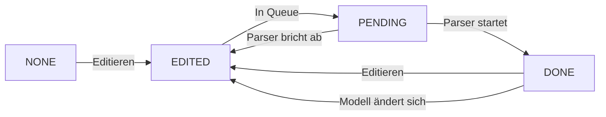

# On-the-Fly Type Parser für EditTree

**Ziel**: Inkrementelles, fehlertolerantes Typ-Parsen für EditTree während des Editierens.

**Autor**: Konzept für die Umsetzung
**Status**: Entwurf (zur Diskussion und Implementation)
**Zielgruppe**: Entwickler, die den Parser implementieren

---

## Inhaltsverzeichnis

1. [Einleitung](#1-einleitung)
2. [Phase 1: Vorbereitung – Infrastruktur](#2-phase-1-vorbereitung--infrastruktur)
3. [Phase 2: ParseState – Zustandsmodell](#3-phase-2-parsestate--zustandsmodell)
4. [Phase 3: lastParsedHash – Optimierung](#4-phase-3-lastparsedhash--optimierung)
5. [Phase 4: Threading – Parser-Thread und Queue](#5-phase-4-threading--parser-thread-und-queue)
6. [Phase 5: Listener – Änderungen erkennen](#6-phase-5-listener--änderungen-erkennen)
7. [Phase 6: TypeParserService – Kernlogik](#7-phase-6-typeparserservice--kernlogik)
8. [Phase 7: Integration – Everything Together](#8-phase-7-integration--everything-together)
9. [Phase 8: UI-Integration – Feedback für den Benutzer](#9-phase-8-ui-integration--feedback-für-den-benutzer)
10. [Phase 9: Testing – Validierung](#10-phase-9-testing--validierung)
11. [Anhang: Code-Snippets (Beispiele)](#anhang-code-snippets-beispiele)

---

## 1. Einleitung

### 1.1 Problemstellung

Aktuell wird die Typisierung im EditTree nur manuell oder durch explizite Aufrufe von `assignTypesFromModel()` oder `assignTypesForNode()` getriggert. Für ein **On-the-Fly-Parsen** während des Editierens fehlt:

- Ein **Zustandsmodell**, das den Parse-Fortschritt eines Knotens abbildet.
- Ein **Mechanismus**, um Änderungen zu erkennen und automatisch nachzuparsen.
- Eine **thread-sichere Architektur**, die die UI nicht blockiert.
- Eine **Optimierung**, um unnötiges Reparsing zu vermeiden.

### 1.2 Ziele

| **Ziel** | **Beschreibung** |
|----------|------------------|
| **Inkrementelles Parsen** | Parsen von Teilbäumen, nicht nur des gesamten Baums. |
| **Fehlertoleranz** | Parsen bricht nicht bei Fehlern ab, sondern setzt `EditStatus` (WARNING/ERROR). |
| **Automatische Typableitung** | Wenn ein Feldname im Modell eindeutig ist, wird der Parent-Typ abgeleitet. |
| **Reaktive Updates** | Änderungen (Umbenennung, Typ-Änderung, Löschung) trigger Reparsing. |
| **On-the-Fly** | Parsen passiert während des Editierens, nicht als Batch-Operation. |
| **Thread-Safety** | UI bleibt responsiv, Parsen läuft im Hintergrund. |

### 1.3 Nicht-Ziele

- **Kein Batch-Parsing**: Der Fokus liegt auf inkrementellem Parsen.
- **Keine Persistenz des ParseState**: `ParseState` wird nicht in Dateien gespeichert (nur zur Laufzeit relevant).
- **Keine Versionierung des Modells**: Es wird immer das aktuelle `JsonModelDescriptor` verwendet.

---

## 2. Phase 1: Vorbereitung – Infrastruktur

### 1.1 Was muss vorbereitet werden?

Bevor mit der Implementierung begonnen wird, müssen folgende Punkte geklärt und vorbereitet werden:

#### 1.1.1 Abhängigkeiten prüfen

- **EditTree**: Muss `JsonModelDescriptor` halten (bereits vorhanden).
- **EditNodeAbstract**: Basis-Klasse für alle Nodes (bereits vorhanden).
- **JsonModelDescriptor**: Muss Methoden zur Typ- und Feldsuche bereitstellen (bereits vorhanden).

#### 1.1.2 Neue Felder und Klassen

| **Klasse** | **Neues Feld/Methode** | **Zweck** |
|------------|------------------------|-----------|
| `EditNodeAbstract` | `ParseState parseState` | Zustand des Parsens (NONE, EDITED, PENDING, DONE) |
| `EditNodeAbstract` | `long lastParsedHash` | Hash zur Optimierung (vermeidet unnötiges Reparsing) |
| `EditNodeAbstract` | `void computeHash()` | Berechnet den aktuellen Hash des Knotens |
| `EditTree` | `TypeParserService parserService` | Referenz auf den Parser |
| `EditTree` | `ConcurrentLinkedQueue<EditNodeAbstract> parseQueue` | Warteschlange für zu parsende Knoten |
| `EditTree` | `Set<EditNodeAbstract> pendingNodes` | Deduplizierung für die Queue |
| `TypeParserService` | (Neue Klasse) | Zentrale Parsen-Logik |

#### 1.1.3 vorbereitende Aufgaben

- [ ] **Codebase durchsuchen**: Prüfen, ob bestehende Klassen (`EditTree`, `EditNodeAbstract`) für die Erweiterungen geeignet sind.
- [ ] **Thread-Safety prüfen**: sicherstellen, dass `EditTree` und `EditNode`-Methoden thread-safe sind oder gemacht werden können.
- [ ] **Build-System anpassen**: Falls neue Abhängigkeiten (z. B. `ConcurrentLinkedQueue`) benötigt werden, sicherstellen, dass diese verfügbar sind.

### 1.2 Lösungsvorschlag: Vorbereitung

1. **Neue Enum-Klasse `ParseState` erstellen** (siehe Phase 2).
2. **`EditNodeAbstract` erweitern**: Felder `parseState` und `lastParsedHash` hinzufügen.
3. **`EditTree` erweitern**: Queue und Set für das Parsen hinzufügen.
4. **`TypeParserService` als neue Klasse anlegen** (leere Hülle für Phase 6).

### 1.3 Beispiel: Vorbereitung

```java
// EditNodeAbstract.java - Erweiterungen
public abstract class EditNodeAbstract implements EditNode {
    private ParseState parseState = ParseState.NONE;  // Neues Feld
    private long lastParsedHash;                       // Neues Feld
    
    public ParseState getParseState() { return parseState; }
    public void setParseState(ParseState state) { this.parseState = state; }
    
    public long getLastParsedHash() { return lastParsedHash; }
    public void setLastParsedHash(long hash) { this.lastParsedHash = hash; }
    
    public long computeHash() { ... }  // Siehe Phase 3
}
```

```java
// EditTree.java - Erweiterungen
public class EditTree {
    private final ConcurrentLinkedQueue<EditNodeAbstract> parseQueue = new ConcurrentLinkedQueue<>();
    private final Set<EditNodeAbstract> pendingNodes = ConcurrentHashMap.newKeySet();
    private TypeParserService parserService;
    
    public void addToParseQueue(EditNodeAbstract node) {
        if (pendingNodes.add(node)) {  // Deduplizierung
            parseQueue.add(node);
        }
    }
}
```

---

## 3. Phase 2: ParseState – Zustandsmodell

### 2.1 Problem

Aktuell gibt es kein klares Zustandsmodell für den **Parse-Fortschritt** eines Knotens. `EditStatus` wird für Validierung verwendet, aber nicht für den Parse-Prozess.

### 2.2 Anforderungen an ParseState

| **Anforderung** | **Beschreibung** |
|------------------|------------------|
| **Trennung von Validierung** | `ParseState` und `EditStatus` müssen unabhängig voneinander sein. |
| **Klare Zustände** | Jeder Zustand muss eine klare Bedeutung haben. |
| **UI-Feedback** | Die UI muss den Zustand anzeigen können (z. B. Symbol für "wird bearbeitet"). |

### 2.3 Lösungsvorschlag: ParseState-Enum

```java
/**
 * Beschreibt den Parse-Zustand eines Knotens.
 * UNTERSCHEIDET SICH VON EditStatus (Validierung)! 
 */
public enum ParseState {
    /**
     * Der Knoten wurde noch nie geparst (z. B. nach dem Laden).
     */
    NONE,
    
    /**
     * Der Knoten wurde editiert (z. B. Umbenennung, Wertänderung).
     * Muss neu geparst werden.
     */
    EDITED,
    
    /**
     * Der Knoten steht in der Warteschlange und wartet auf Parsen.
     */
    PENDING,
    
    /**
     * Der Knoten wurde erfolgreich geparst.
     */
    DONE
}
```

#### 2.3.1 Zustandsübergänge



| **Von** | **Nach** | **Auslöser** |
|---------|----------|--------------|
| NONE | EDITED | Knoten wird editiert (z. B. `setName()`) |
| EDITED | PENDING | Knoten wird in die Queue gestellt |
| PENDING | DONE | Parser hat den Knoten erfolgreich geparst |
| DONE | EDITED | Knoten wird erneut editiert |
| PENDING | EDITED | Parser bricht ab (z. B. durch Fehler) |

### 2.4 Beispiel: Verwendung von ParseState

```java
// EditNodeObject.setName()
@Override
public void setName(String name) {
    this.objektValue = name;
    setParseState(ParseState.EDITED);  // Markiere als editiert
    
    // Trigger Reparsing
    EditTree tree = getEditTree();
    if (tree != null) {
        tree.addToParseQueue(this);
    }
}
```

```java
// TypeParserService.parseNode()
public void parseNode(EditNodeAbstract node) {
    node.setParseState(ParseState.PENDING);  // In Queue
    
    // Parsen durchführen...
    boolean success = node.tryAssignType(tree.getJsonModelDescriptor());
    
    node.setParseState(ParseState.DONE);  // Fertig
}
```

### 2.5 Aufgaben für diese Phase

- [ ] `ParseState`-Enum erstellen (wie oben).
- [ ] `EditNodeAbstract` um `parseState`-Feld erweitern.
- [ ] `setParseState()` in allen relevanten Methoden aufrufen (z. B. `setName()`, `setValue()`).
- [ ] Existing Code durchsuchen: Wo müssen `ParseState`-Übergänge ausgelöst werden?

---

## 4. Phase 3: lastParsedHash – Optimierung

### 3.1 Problem

Ohne Optimierung wird jeder editierte Knoten **sofort neu geparst**, selbst wenn sich nichts Relevantes geändert hat (z. B. nur ein Leerzeichen im Namen).

### 3.2 Anforderungen

| **Anforderung** | **Beschreibung** |
|------------------|------------------|
| **Schnelle Berechnung** | Der Hash muss schnell berechnet werden können. |
| **Ausreichende Genauigkeit** | Der Hash muss ändern, wenn sich der Knoten in einer für das Parsen relevanten Weise ändert. |
| **Geringer Speicherbedarf** | Der Hash sollte nicht zu viel Speicher verbrauchen. |

### 3.3 Lösungsvorschlag: Flacher Hash

Ein **flacher Hash** (nicht rekursiv) reicht aus, um zu erkennen, ob sich ein Knoten in einer für das Parsen relevanten Weise geändert hat.

#### 3.3.1 Hash-Berechnung

```java
/**
 * Berechnet einen Hash für den Knoten (flach, nicht rekursiv).
 * Wird verwendet, um zu prüfen, ob sich der Knoten seit dem letzten Parsen geändert hat.
 */
public long computeHash() {
    return Objects.hash(
        getName(),           // Name des Knotens
        getValue(),          // Wert (falls vorhanden)
        getClass(),          // Typ des Knotens (EditNodeObject/Property)
        getChildCount(),     // Anzahl der Kinder (nicht rekursiv!)
        getJsonType(),       // Aktueller jsonType (falls vorhanden)
        getJsonField()       // Aktueller jsonField (falls vorhanden)
    );
}
```

#### 3.3.2 Wann wird der Hash berechnet?

| **Methode** | **Aktion** |
|-------------|------------|
| `setName()` | `lastParsedHash` zurücksetzen (oder neu berechnen) |
| `setValue()` | `lastParsedHash` zurücksetzen |
| `addChild()` | `lastParsedHash` zurücksetzen |
| `removeChild()` | `lastParsedHash` zurücksetzen |
| `setJsonType()` | `lastParsedHash` zurücksetzen |
| `setJsonField()` | `lastParsedHash` zurücksetzen |

#### 3.3.3 Verwendung des Hashs

Der Parser kann den Hash verwenden, um zu prüfen, ob sich ein Knoten seit dem letzten Parsen geändert hat:

```java
public void parseNode(EditNodeAbstract node) {
    long currentHash = node.computeHash();
    long lastHash = node.getLastParsedHash();
    
    if (currentHash == lastHash) {
        // Keine Änderungen seit dem letzten Parsen → überspringen
        node.setParseState(ParseState.DONE);
        return;
    }
    
    // Parsen durchführen...
    node.tryAssignType(tree.getJsonModelDescriptor());
    node.setLastParsedHash(currentHash);  // Hash aktualisieren
    node.setParseState(ParseState.DONE);
}
```

### 3.4 Vor- und Nachteile

| **Aspekt** | **Vorteile** | **Nachteile** |
|------------|--------------|---------------|
| **Performance** | Flacher Hash ist schnell berechenbar (O(1)). | Nicht 100% genau (z. B. bei Änderungen in tiefen Teilbäumen). |
| **Speicher** | `long` verbraucht nur 8 Bytes pro Knoten. | - |
| **Genauigkeit** | Ausreichend für die meisten Fälle. | Bei komplexen Änderungen könnte der Hash gleich bleiben, obwohl sich der Knoten relevant geändert hat. |

### 3.5 Aufgaben für diese Phase

- [ ] `computeHash()` in `EditNodeAbstract` implementieren.
- [ ] `lastParsedHash` in `EditNodeAbstract` hinzufügen.
- [ ] `lastParsedHash` in allen relevanten Setter-Methoden zurücksetzen.
- [ ] Parser so anpassen, dass er den Hash zur Optimierung verwendet.

---

## 5. Phase 4: Threading – Parser-Thread und Queue

### 4.1 Problem

Parsen kann zeitintensiv sein (z. B. bei großen Bäumen oder komplexen Modellen). Wenn das Parsen im UI-Thread läuft, blockiert es die UI.

### 4.2 Anforderungen

| **Anforderung** | **Beschreibung** |
|------------------|------------------|
| **UI bleibt responsiv** | Parsen darf den UI-Thread nicht blockieren. |
| **Thread-Safety** | Der Zugriff auf `EditTree` und `EditNode` muss thread-safe sein. |
| **Effiziente Verarbeitung** | Der Parser sollte Knoten effizient und ohne Duplikate verarbeiten. |

### 4.3 Lösungsvorschlag: Thread-Pool + Queue

#### 4.3.1 Architektur

```
┌───────────────────────────────────────────────────────┐
│                   EditTree                                 │
│  ┌───────────────────────────────────────────────────┐  │
│  │               parseQueue                               │  │
│  │  (ConcurrentLinkedQueue<EditNodeAbstract>)           │  │
│  └───────────────────────────────────────────────────┘  │
│  ┌───────────────────────────────────────────────────┐  │
│  │               pendingNodes                              │  │
│  │  (Set<EditNodeAbstract> für Deduplizierung)           │  │
│  └───────────────────────────────────────────────────┘  │
└───────────────────────────────────────────────────────┘
                              │
                              ▼
┌───────────────────────────────────────────────────────┐
│                 TypeParserService                         │
│  ┌───────────────────────────────────────────────────┐  │
│  │               ExecutorService (Thread-Pool)           │  │
│  │  - 1-2 Threads                                         │  │
│  │  - Verarbeitet parseQueue                             │  │
│  └───────────────────────────────────────────────────┘  │
└───────────────────────────────────────────────────────┘
```

#### 4.3.2 Implementierung

1. **Thread-Pool in `TypeParserService`**:

```java
public class TypeParserService {
    private final ExecutorService executor = Executors.newFixedThreadPool(2);
    private final Map<EditTree, Future<?>> activeTasks = new WeakHashMap<>();
    
    public void start(EditTree tree) {
        Future<?> future = executor.submit(() -> processQueue(tree));
        activeTasks.put(tree, future);
    }
    
    private void processQueue(EditTree tree) {
        while (!Thread.currentThread().isInterrupted()) {
            EditNodeAbstract node = tree.getParseQueue().poll();
            if (node == null) {
                try {
                    Thread.sleep(100);  // Warten, wenn Queue leer
                } catch (InterruptedException e) {
                    Thread.currentThread().interrupt();
                    break;
                }
                continue;
            }
            parseNode(node, tree);
            tree.getPendingNodes().remove(node);  // Aus Set entfernen
        }
    }
    
    public void shutdown() {
        executor.shutdown();
    }
}
```

2. **Thread-Safety in `EditTree` und `EditNode`**:

- **`EditTree`**:
  - `parseQueue` und `pendingNodes` sind bereits thread-safe (`ConcurrentLinkedQueue`, `ConcurrentHashMap.newKeySet()`).
  - `JsonModelDescriptor` sollte **immutable** sein oder über `ReadWriteLock` geschützt werden.

- **`EditNode`**:
  - `parseState` und `lastParsedHash` können **atomar** gesetzt werden (keine komplexen Operationen).
  - `setJsonType()` und `setJsonField()` müssen thread-safe sein (z. B. `synchronized` oder `volatile`).

#### 4.3.3 Beispiel: Thread-Safety

```java
// EditNodeAbstract.java
public void setParseState(ParseState state) {
    this.parseState = state;  // volatile oder AtomicReference für Thread-Safety
}

public void setJsonType(JsonTypeDescriptor type) {
    synchronized (this) {  // Thread-Safety
        this.jsonType = type;
    }
}
```

### 4.4 Vor- und Nachteile

| **Aspekt** | **Vorteile** | **Nachteile** |
|------------|--------------|---------------|
| **Performance** | UI bleibt responsiv, Parsen läuft im Hintergrund. | Thread-Overhead (1-2 Threads). |
| **Thread-Safety** | `ConcurrentLinkedQueue` und `ConcurrentHashMap` sind thread-safe. | Komplexität bei Shared State (z. B. `EditTree`). |
| **Skalierbarkeit** | Thread-Pool kann auf mehrere EditTrees skalieren. | Bei vielen EditTrees könnte der Thread-Pool zu klein sein. |

### 4.5 Aufgaben für diese Phase

- [ ] `TypeParserService` mit `ExecutorService` implementieren.
- [ ] `EditTree` um `parseQueue` und `pendingNodes` erweitern.
- [ ] Thread-Safety für `EditNode`-Methoden (`setJsonType`, `setJsonField`) sicherstellen.
- [ ] `TypeParserService` in `EditTree` integrieren und starten/stoppen.

---

## 6. Phase 5: Listener – Änderungen erkennen

### 5.1 Problem

Der Parser muss **automatisch** erkennen, wenn sich ein Knoten ändert, um Reparsing auszulösen.

### 5.2 Anforderungen

| **Anforderung** | **Beschreibung** |
|------------------|------------------|
| **Automatische Erkennung** | Der Parser soll Änderungen ohne manuellen Aufruf erkennen. |
| **Effizienz** | Nicht jede kleine Änderung sollte ein Reparsing auslösen. |
| **Deduplizierung** | Derselbe Knoten soll nicht mehrfach in die Queue kommen. |

### 5.3 Lösungsvorschlag: Listener auf EditTree

#### 5.3.1 Änderungen, die Reparsing auslösen

| **Änderung** | **Betroffener Knoten** | **Aktion** |
|--------------|------------------------|------------|
| Node hinzugefügt | Parent | Parent und neues Kind in Queue |
| Node entfernt | Parent | Parent in Queue |
| Node umbenannt | Node selbst | Node in Queue |
| Node-Wert geändert | Node selbst | Node in Queue |
| Node verschoben | Node und Parent | Node und Parent in Queue |
| Typ manuell gesetzt | Node selbst | Node und alle Kinder in Queue |
| Typ gelöscht | Node selbst | Node und alle Kinder in Queue |

#### 5.3.2 Implementierung

1. **Listener-Interface**:

```java
public interface TypeParserListener {
    void onNodeAdded(EditNodeAbstract parent, EditNodeAbstract child);
    void onNodeRemoved(EditNodeAbstract parent, EditNodeAbstract child);
    void onNodeRenamed(EditNodeAbstract node, String oldName);
    void onNodeValueChanged(EditNodeAbstract node);
    void onNodeMoved(EditNodeAbstract node, EditNodeAbstract oldParent);
    void onTypeChanged(EditNodeAbstract node);
}
```

2. **Listener in `EditTree` registrieren**:

```java
public class EditTree {
    private final List<TypeParserListener> listeners = new ArrayList<>();
    
    public void addTypeParserListener(TypeParserListener listener) {
        listeners.add(listener);
    }
    
    public void removeTypeParserListener(TypeParserListener listener) {
        listeners.remove(listener);
    }
    
    private void fireNodeRenamed(EditNodeAbstract node, String oldName) {
        for (TypeParserListener listener : listeners) {
            listener.onNodeRenamed(node, oldName);
        }
    }
}
```

3. **Listener in `EditNode`-Methoden aufrufen**:

```java
// EditNodeAbstract.java
@Override
public void setName(String name) {
    String oldName = this.name;
    this.name = name;
    setParseState(ParseState.EDITED);
    
    EditTree tree = getEditTree();
    if (tree != null) {
        tree.fireNodeRenamed(this, oldName);
        tree.addToParseQueue(this);
    }
}
```

4. **Listener in `TypeParserService` implementieren**:

```java
public class TypeParserService implements TypeParserListener {
    @Override
    public void onNodeRenamed(EditNodeAbstract node, String oldName) {
        EditTree tree = node.getEditTree();
        tree.addToParseQueue(node);
    }
    
    @Override
    public void onTypeChanged(EditNodeAbstract node) {
        EditTree tree = node.getEditTree();
        tree.addToParseQueue(node);
        // Alle Kinder müssen ebenfalls neu geparst werden
        for (int i = 0; i < node.getChildCount(); i++) {
            tree.addToParseQueue((EditNodeAbstract) node.getChildAt(i));
        }
    }
}
```

### 5.4 Vor- und Nachteile

| **Aspekt** | **Vorteile** | **Nachteile** |
|------------|--------------|---------------|
| **Automatisierung** | Reparsing wird automatisch ausgelöst. | Listener müssen in allen relevanten Methoden aufgerufen werden. |
| **Effizienz** | Nur betroffene Knoten werden in die Queue gestellt. | Overhead durch Listener-Aufrufe. |
| **Deduplizierung** | `pendingNodes` verhindert Duplikate. | - |

### 5.5 Aufgaben für diese Phase

- [ ] `TypeParserListener`-Interface erstellen.
- [ ] `EditTree` um Listener-Registrierung erweitern.
- [ ] Listener-Aufrufe in `EditNode`-Methoden (`setName`, `setValue`, etc.) hinzufügen.
- [ ] `TypeParserService` als `TypeParserListener` implementieren.

---

## 7. Phase 6: TypeParserService – Kernlogik

### 6.1 Problem

Die Kernlogik des Parsens muss in einer zentralen Klasse (`TypeParserService`) gebündelt werden.

### 6.2 Anforderungen

| **Anforderung** | **Beschreibung** |
|------------------|------------------|
| **Inkrementelles Parsen** | Parsen von Teilbäumen, nicht nur des gesamten Baums. |
| **Fehlertoleranz** | Parsen bricht nicht bei Fehlern ab. |
| **Automatische Typableitung** | Wenn ein Feldname im Modell eindeutig ist, wird der Parent-Typ abgeleitet. |

### 6.3 Lösungsvorschlag: TypeParserService

#### 6.3.1 Hauptmethoden

```java
public class TypeParserService {
    private final ExecutorService executor = Executors.newFixedThreadPool(2);
    
    /**
     * Startet den Parser für einen EditTree.
     */
    public void startForTree(EditTree tree) {
        executor.submit(() -> processQueue(tree));
    }
    
    /**
     * Verarbeitet die Parse-Queue eines EditTree.
     */
    private void processQueue(EditTree tree) {
        while (!Thread.currentThread().isInterrupted()) {
            EditNodeAbstract node = tree.getParseQueue().poll();
            if (node == null) {
                try {
                    Thread.sleep(100);
                } catch (InterruptedException e) {
                    Thread.currentThread().interrupt();
                    break;
                }
                continue;
            }
            parseNode(node, tree);
            tree.getPendingNodes().remove(node);
        }
    }
    
    /**
     * Parst einen einzelnen Knoten.
     */
    private void parseNode(EditNodeAbstract node, EditTree tree) {
        JsonModelDescriptor model = tree.getJsonModelDescriptor();
        if (model == null) {
            node.setParseState(ParseState.DONE);
            node.setEditStatus(EditStatus.WARNING);
            node.setEditMessage("No model descriptor available");
            return;
        }
        
        // Hash prüfen
        long currentHash = node.computeHash();
        if (currentHash == node.getLastParsedHash()) {
            node.setParseState(ParseState.DONE);
            return;  // Keine Änderungen
        }
        
        // Parsen durchführen
        node.setParseState(ParseState.PENDING);
        boolean success = node.tryAssignType(model);
        
        // Hash und Zustand aktualisieren
        node.setLastParsedHash(currentHash);
        node.setParseState(ParseState.DONE);
        
        // Falls der Knoten ein EditNodeObject ist, prüfe, ob Parent-Typ abgeleitet werden kann
        if (node instanceof EditNodeObject) {
            tryInferParentTypes((EditNodeObject) node, tree);
        }
    }
    
    /**
     * Versucht, den Typ des Parents abzuleiten, falls dieser keinen Typ hat.
     */
    private void tryInferParentTypes(EditNodeObject node, EditTree tree) {
        EditNode parent = node.getParent();
        if (!(parent instanceof EditNodeObject)) {
            return;
        }
        EditNodeObject parentObject = (EditNodeObject) parent;
        if (parentObject.getJsonType() != null) {
            return;  // Parent hat bereits einen Typ
        }
        
        JsonModelDescriptor model = tree.getJsonModelDescriptor();
        if (model == null) {
            return;
        }
        
        // Suche nach Typen, die ein Feld mit dem Namen des Nodes haben
        List<JsonTypeDescriptor> typesWithField = model.getTypesContainingField(node.getName());
        if (typesWithField.size() == 1) {
            parentObject.setJsonType(typesWithField.get(0));
            parentObject.setParseState(ParseState.EDITED);
            tree.addToParseQueue(parentObject);  // Parent neu parsen
        } else if (typesWithField.size() > 1) {
            parentObject.setEditStatus(EditStatus.WARNING);
            parentObject.setEditMessage("Field '" + node.getName() + "' is ambiguous");
        }
    }
}
```

#### 6.3.2 Typableitung für EditNodeObject

```java
// EditNodeObject.java
@Override
public boolean tryAssignType(JsonModelDescriptor descriptor) {
    if (descriptor == null) {
        setEditStatus(EditStatus.STATELESS);
        setEditMessage(null);
        return false;
    }

    String name = getName();
    if (name == null || name.isEmpty()) {
        setEditStatus(EditStatus.WARNING);
        setEditMessage("Object node has no name for type assignment");
        return false;
    }

    // Suche nach dem Typ im Modell
    JsonTypeDescriptor foundType = descriptor.getType(name);
    if (foundType == null) {
        foundType = descriptor.getTypePerceptive(name);
    }

    if (foundType != null) {
        setJsonType(foundType);
        setEditStatus(EditStatus.OKAY);
        setEditMessage(null);
        return true;
    } else {
        setEditStatus(EditStatus.WARNING);
        setEditMessage("Type '" + name + "' not found in model");
        return false;
    }
}
```

#### 6.3.3 Typableitung für EditNodeProperty

```java
// EditNodeProperty.java
@Override
public boolean tryAssignType(JsonModelDescriptor descriptor) {
    if (descriptor == null) {
        setEditStatus(EditStatus.STATELESS);
        setEditMessage(null);
        return false;
    }

    EditNode parent = getParent();
    if (!(parent instanceof EditNodeObject)) {
        setEditStatus(EditStatus.WARNING);
        setEditMessage("Cannot resolve field: parent has no type");
        return false;
    }

    EditNodeObject parentObject = (EditNodeObject) parent;
    JsonTypeDescriptor parentType = parentObject.getJsonType();

    if (parentType == null) {
        setEditStatus(EditStatus.WARNING);
        setEditMessage("Cannot resolve field: parent has no type descriptor");
        return false;
    }

    String fieldName = getName();
    if (fieldName == null || fieldName.isEmpty()) {
        setEditStatus(EditStatus.WARNING);
        setEditMessage("Property has no name for field assignment");
        return false;
    }

    JsonFieldDescriptor foundField = parentType.getField(fieldName);
    if (foundField == null) {
        foundField = parentType.getFieldPerceptive(fieldName);
    }

    if (foundField != null) {
        setJsonField(foundField);
        setEditStatus(EditStatus.OKAY);
        setEditMessage(null);
        return true;
    } else {
        setEditStatus(EditStatus.ERROR);
        setEditMessage("Field '" + fieldName + "' not found in type '" + parentType.getTypeName() + "'");
        return false;
    }
}
```

### 6.4 Aufgaben für diese Phase

- [ ] `TypeParserService` mit `ExecutorService` und `processQueue` implementieren.
- [ ] `parseNode`-Methode implementieren (mit Hash-Prüfung).
- [ ] `tryInferParentTypes`-Methode für automatische Typableitung implementieren.
- [ ] `tryAssignType` in `EditNodeObject` und `EditNodeProperty` anpassen (falls nötig).

---

## 8. Phase 7: Integration – Everything Together

### 7.1 Problem

Alle Komponenten müssen zusammenarbeiten:
- `ParseState` in `EditNode`
- `lastParsedHash` in `EditNode`
- `parseQueue` in `EditTree`
- `TypeParserService` als zentrale Parsen-Logik
- Listener für Änderungen

### 7.2 Lösungsvorschlag: Schritt-für-Schritt-Integration

#### 7.2.1 Schritt 1: EditTree initialisieren

```java
// EditTree.java
public EditTree(EditNodeAbstract root, EditTimes weightMonitor) {
    super(root);
    this.weightMonitor = weightMonitor;
    this.parserService = new TypeParserService();
    this.parserService.addTypeParserListener(this);  // EditTree als Listener
}

public void startParsing() {
    parserService.startForTree(this);
}

public void stopParsing() {
    parserService.shutdown();
}
```

#### 7.2.2 Schritt 2: EditTree als Listener

```java
// EditTree.java
public class EditTree implements TypeParserListener {
    @Override
    public void onNodeRenamed(EditNodeAbstract node, String oldName) {
        addToParseQueue(node);
    }
    
    @Override
    public void onTypeChanged(EditNodeAbstract node) {
        addToParseQueue(node);
        // Kinder müssen ebenfalls neu geparst werden
        for (int i = 0; i < node.getChildCount(); i++) {
            EditNode child = node.getChildAt(i);
            if (child instanceof EditNodeAbstract) {
                addToParseQueue((EditNodeAbstract) child);
            }
        }
    }
    
    // Weitere Listener-Methoden implementieren...
}
```

#### 7.2.3 Schritt 3: EditTree mit Modell verbinden

```java
// EditTree.java
public void setJsonModelDescriptor(JsonModelDescriptor descriptor) {
    this.jsonModelDescriptor = descriptor;
    // Vollständiges Reparsing auslösen
    for (int i = 0; i < getRoot().getChildCount(); i++) {
        EditNode child = getRoot().getChildAt(i);
        if (child instanceof EditNodeAbstract) {
            addToParseQueue((EditNodeAbstract) child);
        }
    }
}
```

### 7.3 Aufgaben für diese Phase

- [ ] `TypeParserService` in `EditTree` integrieren.
- [ ] `EditTree` als `TypeParserListener` implementieren.
- [ ] `setJsonModelDescriptor` anpassen, um Reparsing auszulösen.
- [ ] `startParsing()` und `stopParsing()` in `EditTree` hinzufügen.

---

## 9. Phase 8: UI-Integration – Feedback für den Benutzer

### 8.1 Problem

Der Benutzer muss **Feedback** erhalten, ob und wie der Parse-Prozess läuft.

### 8.2 Anforderungen

| **Anforderung** | **Beschreibung** |
|------------------|------------------|
| **ParseState anzeigen** | Der Benutzer soll sehen, ob ein Knoten geparst wird/wurde. |
| **EditStatus anzeigen** | Der Benutzer soll Validierungsfehler sehen. |
| **lastParsedHash anzeigen** | (Optional) Der Benutzer soll sehen, ob ein Knoten aktuell ist. |

### 8.3 Lösungsvorschlag: UI-Integration

#### 8.3.1 ParseState → Symbol

| **ParseState** | **Symbol** | **Beschreibung** |
|----------------|------------|------------------|
| NONE | ❓ | Noch nie geparst |
| EDITED | ⚠️ | Editiert, muss neu geparst werden |
| PENDING | ⏳ | Wird geparst |
| DONE | ✅ | Erfolgreich geparst |

#### 8.3.2 EditStatus → Farbe

| **EditStatus** | **Farbe** | **Beschreibung** |
|----------------|-----------|------------------|
| OKAY | Grün | Keine Fehler |
| WARNING | Gelb | Warnung (z. B. Typ nicht gefunden) |
| ERROR | Rot | Fehler (z. B. Feld nicht gefunden) |
| STATELESS | Grau | Kein Zustand |

#### 8.3.3 Beispiel: UI-Renderer

```java
public class EditNodeRenderer {
    public String getSymbol(EditNode node) {
        ParseState parseState = node.getParseState();
        switch (parseState) {
            case NONE:     return "❓";
            case EDITED:   return "⚠️";
            case PENDING:  return "⏳";
            case DONE:     return "✅";
            default:        return "";
        }
    }
    
    public Color getColor(EditNode node) {
        EditStatus editStatus = node.getEditStatus();
        switch (editStatus) {
            case OKAY:      return Color.GREEN;
            case WARNING:   return Color.YELLOW;
            case ERROR:     return Color.RED;
            case STATELESS: return Color.GRAY;
            default:        return Color.BLACK;
        }
    }
    
    public String getTooltip(EditNode node) {
        StringBuilder tooltip = new StringBuilder();
        tooltip.append("Parse: ").append(node.getParseState());
        if (node.getEditMessage() != null) {
            tooltip.append(" | ").append(node.getEditMessage());
        }
        return tooltip.toString();
    }
}
```

#### 8.3.4 UI-Events

Falls die UI **reaktiv** sein soll (z. B. bei Änderungen von `ParseState` oder `EditStatus`), kann ein **Listener auf `EditNode`-Änderungen** registriert werden:

```java
public interface EditNodeUIListener {
    void onParseStateChanged(EditNode node, ParseState oldState, ParseState newState);
    void onEditStatusChanged(EditNode node, EditStatus oldStatus, EditStatus newStatus);
}
```

### 8.4 Aufgaben für diese Phase

- [ ] UI-Renderer für `ParseState` und `EditStatus` implementieren.
- [ ] Symbole und Farben in der UI anzeigen.
- [ ] Tooltips für `ParseState` und `EditMessage` hinzufügen.
- [ ] (Optional) Listener für UI-Updates implementieren.

---

## 10. Phase 9: Testing – Validierung

### 9.1 Teststrategie

| **Testtyp** | **Zweck** | **Beispiele** |
|-------------|-----------|---------------|
| **Unit-Tests** | Einzelne Methoden testen | `computeHash()`, `parseNode()` |
| **Integrationstests** | Zusammenwirken der Komponenten testen | `TypeParserService` + `EditTree` |
| **Thread-Safety-Tests** | Thread-Safety prüfen | Mehrere Threads auf `EditTree` zugreifen |
| **UI-Tests** | UI-Integration testen | `ParseState` und `EditStatus` in UI |

### 9.2 Testfälle

#### 9.2.1 Unit-Tests

```java
@Test
public void testComputeHash() {
    EditNodeObject node = new EditNodeObject("test");
    long hash1 = node.computeHash();
    node.setName("test2");
    long hash2 = node.computeHash();
    assertNotEquals(hash1, hash2);
}

@Test
public void testParseStateTransitions() {
    EditNodeObject node = new EditNodeObject("test");
    assertEquals(ParseState.NONE, node.getParseState());
    node.setName("newName");
    assertEquals(ParseState.EDITED, node.getParseState());
}
```

#### 9.2.2 Integrationstests

```java
@Test
public void testParsingWithModel() {
    EditTree tree = new EditTree(new EditNodeObject("root"), new EditTimes());
    JsonModelDescriptor model = new JsonModelDescriptor();
    model.addType(new JsonTypeDescriptor("Person"));
    tree.setJsonModelDescriptor(model);
    
    EditNodeObject person = new EditNodeObject("Person");
    tree.getRoot().addChild(person);
    tree.addToParseQueue(person);
    
    // Wartet, bis der Parser fertig ist
    await().atMost(1, SECONDS).until(() -> person.getParseState() == ParseState.DONE);
    assertEquals(EditStatus.OKAY, person.getEditStatus());
}
```

#### 9.2.3 Thread-Safety-Tests

```java
@Test
public void testThreadSafety() {
    EditTree tree = new EditTree(new EditNodeObject("root"), new EditTimes());
    JsonModelDescriptor model = new JsonModelDescriptor();
    tree.setJsonModelDescriptor(model);
    
    // Mehrere Threads fügen gleichzeitig Knoten hinzu
    Runnable task = () -> {
        for (int i = 0; i < 100; i++) {
            EditNodeObject node = new EditNodeObject("Node" + i);
            tree.getRoot().addChild(node);
        }
    };
    
    Thread t1 = new Thread(task);
    Thread t2 = new Thread(task);
    t1.start();
    t2.start();
    t1.join();
    t2.join();
    
    // Prüfe, ob alle Knoten hinzugefügt wurden
    assertEquals(200, tree.getRoot().getChildCount());
}
```

### 9.3 Aufgaben für diese Phase

- [ ] Unit-Tests für `ParseState`, `lastParsedHash`, `computeHash()` schreiben.
- [ ] Integrationstests für `TypeParserService` + `EditTree` schreiben.
- [ ] Thread-Safety-Tests schreiben.
- [ ] UI-Tests schreiben (falls UI implementiert wird).

---

## Anhang: Code-Snippets (Beispiele)

### 1. Vollständiges Beispiel: EditNodeAbstract

```java
public abstract class EditNodeAbstract implements EditNode {
    private ParseState parseState = ParseState.NONE;
    private long lastParsedHash;
    
    public ParseState getParseState() { return parseState; }
    public void setParseState(ParseState state) { this.parseState = state; }
    
    public long getLastParsedHash() { return lastParsedHash; }
    public void setLastParsedHash(long hash) { this.lastParsedHash = hash; }
    
    public long computeHash() {
        return Objects.hash(
            getName(),
            getValue(),
            getClass(),
            getChildCount(),
            getJsonType(),
            getJsonField()
        );
    }
    
    @Override
    public void setName(String name) {
        this.name = name;
        setParseState(ParseState.EDITED);
        
        EditTree tree = getEditTree();
        if (tree != null) {
            tree.addToParseQueue(this);
        }
    }
}
```

### 2. Vollständiges Beispiel: EditTree

```java
public class EditTree implements TypeParserListener {
    private final ConcurrentLinkedQueue<EditNodeAbstract> parseQueue = new ConcurrentLinkedQueue<>();
    private final Set<EditNodeAbstract> pendingNodes = ConcurrentHashMap.newKeySet();
    private TypeParserService parserService;
    private JsonModelDescriptor jsonModelDescriptor;
    
    public EditTree(EditNodeAbstract root, EditTimes weightMonitor) {
        super(root);
        this.weightMonitor = weightMonitor;
        this.parserService = new TypeParserService();
        this.parserService.addTypeParserListener(this);
    }
    
    public void startParsing() {
        parserService.startForTree(this);
    }
    
    public void stopParsing() {
        parserService.shutdown();
    }
    
    public void addToParseQueue(EditNodeAbstract node) {
        if (pendingNodes.add(node)) {
            parseQueue.add(node);
        }
    }
    
    public ConcurrentLinkedQueue<EditNodeAbstract> getParseQueue() {
        return parseQueue;
    }
    
    public Set<EditNodeAbstract> getPendingNodes() {
        return pendingNodes;
    }
    
    public void setJsonModelDescriptor(JsonModelDescriptor descriptor) {
        this.jsonModelDescriptor = descriptor;
        // Vollständiges Reparsing auslösen
        for (int i = 0; i < getRoot().getChildCount(); i++) {
            EditNode child = getRoot().getChildAt(i);
            if (child instanceof EditNodeAbstract) {
                addToParseQueue((EditNodeAbstract) child);
            }
        }
    }
    
    public JsonModelDescriptor getJsonModelDescriptor() {
        return jsonModelDescriptor;
    }
    
    // TypeParserListener-Methoden
    @Override
    public void onNodeRenamed(EditNodeAbstract node, String oldName) {
        addToParseQueue(node);
    }
    
    @Override
    public void onTypeChanged(EditNodeAbstract node) {
        addToParseQueue(node);
        for (int i = 0; i < node.getChildCount(); i++) {
            EditNode child = node.getChildAt(i);
            if (child instanceof EditNodeAbstract) {
                addToParseQueue((EditNodeAbstract) child);
            }
        }
    }
    
    // Weitere Listener-Methoden...
}
```

---

## Zusammenfassung

| **Phase** | **Ziel** | **Aufgaben** |
|-----------|----------|--------------|
| 1 | Vorbereitung | Infrastruktur prüfen, neue Felder/Klassen anlegen |
| 2 | ParseState | `ParseState`-Enum erstellen und integrieren |
| 3 | lastParsedHash | Hash-Berechnung und Speicherung implementieren |
| 4 | Threading | `TypeParserService` mit Thread-Pool und Queue implementieren |
| 5 | Listener | `TypeParserListener` erstellen und in `EditTree`/`EditNode` integrieren |
| 6 | TypeParserService | Kernlogik für Parsen implementieren |
| 7 | Integration | Alle Komponenten zusammenführen |
| 8 | UI-Integration | Feedback für den Benutzer implementieren |
| 9 | Testing | Unit-, Integrations- und Thread-Safety-Tests schreiben |

---

**Hinweis**: Dieses Dokument ist als **Anleitung für Entwickler** gedacht. Jede Phase kann unabhängig voneinander implementiert und getestet werden. Die Reihenfolge der Phasen sollte jedoch eingehalten werden, da später Phasen von früher Phasen abhängen.
